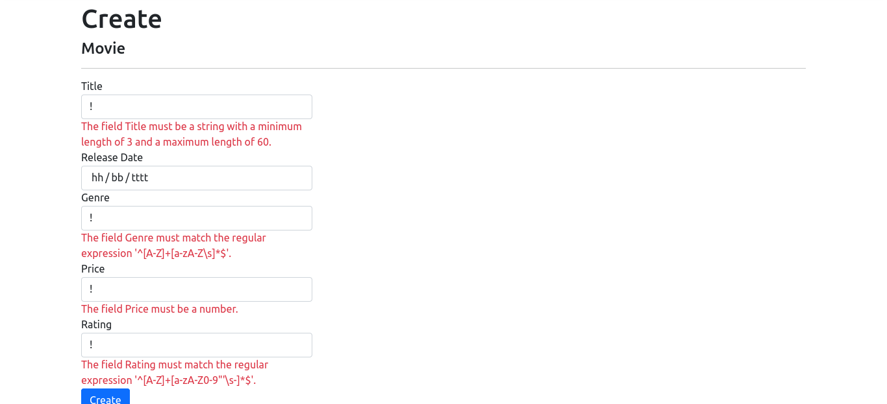
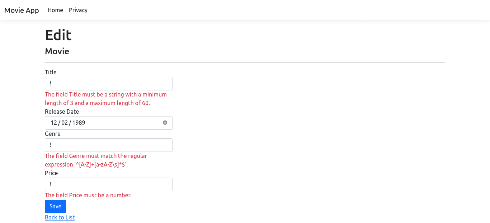
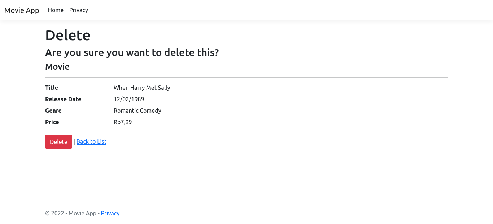
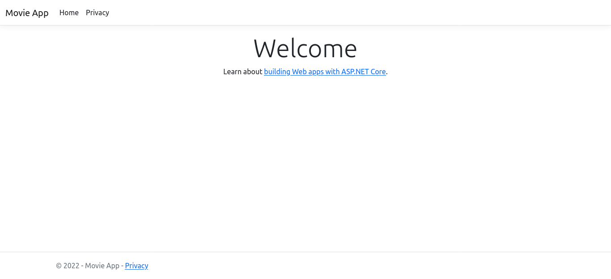
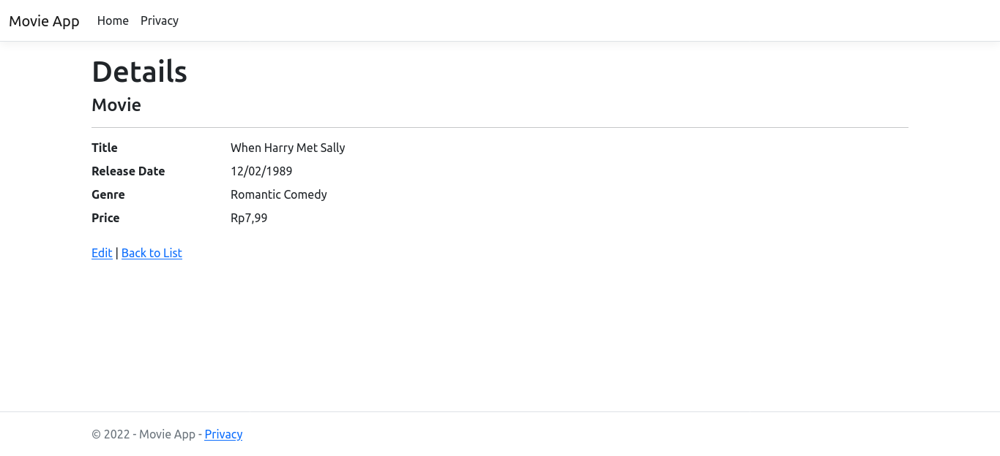
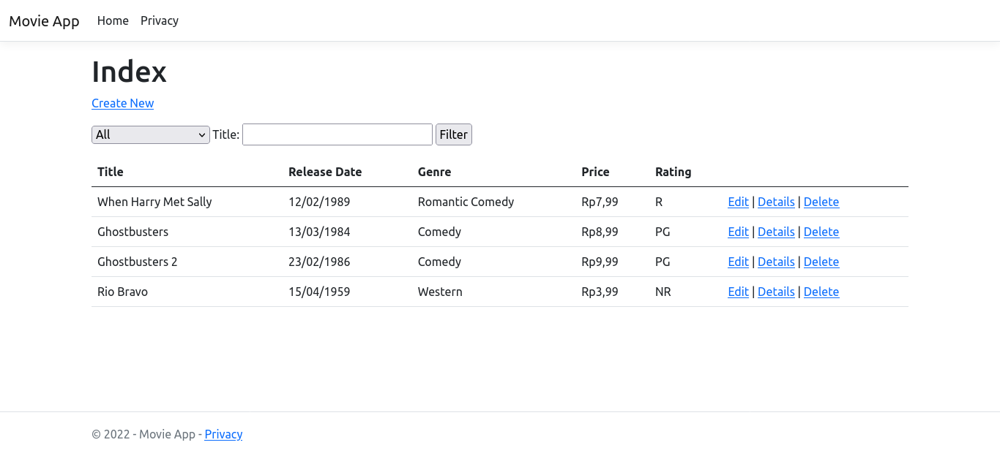

# MvcMovie

## Description
Following tutorial from this link: https://docs.microsoft.com/en-us/aspnet/core/tutorials/first-mvc-app/start-mvc?view=aspnetcore-6.0&tabs=visual-studio . I write this code on ubuntu linux 20.04, with asdf-dotnet-core ( https://github.com/emersonsoares/asdf-dotnet-core ) for build and running code. Dotnet version used is 6.0.300.

## Screenshots
 ### Create
 

 ### Edit
 

 ### Delete
 

 ### Home Page
 

 ### Details
 

 ### Index
 
